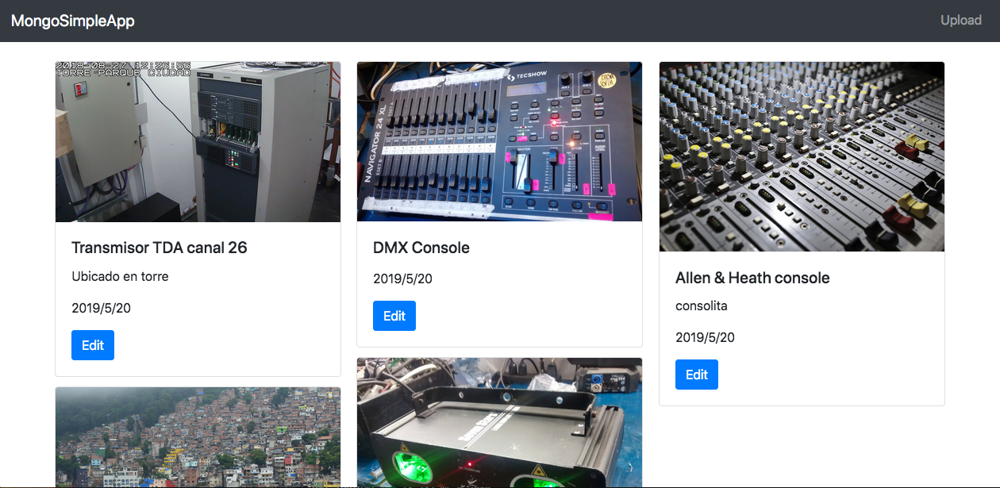
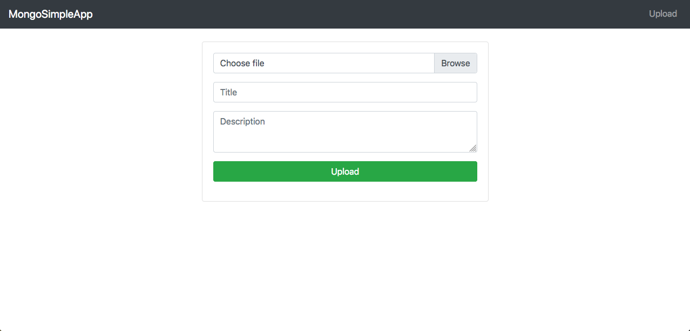

# nodejs-mongodb-app

## File Structure
- src, it's all the code for the Backend and Frontend Application
- docs

## Installation

- MongoDb Server installation is nedded. Last version can be found here: https://www.mongodb.com/try/download/community
- MongoDb bin directory must be in a PATH.
- Before run the app, mongod must be running.
Then..
- npm i
- npm run dev